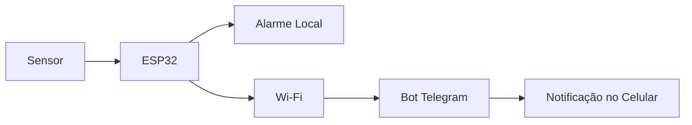

# 🔔 Sistema de Monitoramento e Alerta com ESP32

## 📌 Descrição

Este projeto implementa um **sistema de monitoramento e alerta utilizando o microcontrolador ESP32**.  
O sistema detecta movimentação através de um sensor conectado ao microcontrolador e executa ações automáticas quando um evento é identificado.

Ao detectar movimento, o ESP32 pode:

- 🔊 Acionar um **alarme sonoro**
- 📩 Enviar uma **notificação via Telegram**
- 📊 Registrar ou processar o evento conforme a lógica do código

A comunicação com o usuário ocorre através da **conexão Wi-Fi do ESP32**, permitindo o envio de alertas **em tempo real**.

---

# ⚙️ Funcionamento do Sistema

1. O sensor monitora continuamente o ambiente.  
2. Ao detectar movimentação, envia um **sinal digital** para o ESP32.  
3. O ESP32 interpreta o evento conforme a lógica programada.  
4. O sistema executa as ações configuradas:

- 🔔 acionamento do alarme  
- 📲 envio de mensagem via Telegram  

---

# 🧩 Estrutura Física (Montagem)

O circuito foi montado em **protoboard** utilizando os seguintes componentes.

## Componentes

- ESP32  
- Sensor de movimento  
- Buzzer (alarme)  
- Protoboard  
- Jumpers  
- Fonte de alimentação USB  

---

# 🔌 Conexões do Circuito

| Componente | Conexão ESP32 |
|-------------|--------------|
| Sensor (VCC) | 3.3V |
| Sensor (GND) | GND |
| Sensor (OUT) | GPIO 33 |
| Buzzer (+) | GPIO 25 |
| Buzzer (-) | GND |
| LED Vermelho (+) | GPIO 26 |
| LED Vermelho (-) | Resistor 220Ω → GND |
| LED Verde (+) | GPIO 27 |
| LED Verde (-) | Resistor 220Ω → GND |
| Botão 1 (+) | GPIO 14 |
| Botão 1 (-) | GND |
| Botão 2 (+) | GPIO 12 |
| Botão 2 (-) | GND |
| Botão 3 (+) | GPIO 13 |
| Botão 3 (-) | GND |

⚠️ Os **pinos GPIO permanecem os mesmos em todas as versões dos códigos**.

---

# 📡 Diagrama de Comunicação



💻 Estrutura dos Códigos

O projeto possui diferentes versões do código representando a evolução do sistema:

- /ALARME_1.0
- /ALARME_1.1
- /ALARME_2.0
- /ALARME_2.0.1
- /ALARME_2.1

---

# 🔧 Funções de Cada Versão

## 🔹 Versão 1.0
- comandos físicos de **arme e desarme**
- **sinal sonoro**
- **sinal visual**

---

## 🔹 Versão 1.1
- comandos físicos de **arme e desarme**
- **sinal sonoro**
- **sinal visual**
- **correção de bugs**

---

## 🔹 Versão 2.0
- envio de **mensagem em caso de disparo**
- comandos físicos de **arme e desarme**
- **sinal sonoro**
- **sinal visual**

---

## 🔹 Versão 2.0.1
- envia **mensagem de disparo**
- envia **mensagem de reestabelecimento**
- comandos físicos de **arme e desarme**
- **sinal sonoro**
- **sinal visual**
- melhorias de **bugs**

---

## 🔹 Versão 2.1 (Atual)
- **comandos remotos via Telegram**
- comandos físicos de **arme e desarme**
- **sinal sonoro**
- **sinal visual**
- envia **mensagem de disparo**
- envia **mensagem de reestabelecimento**
- envia **mensagem de status**
- comando **/help**
- comando **/status**

---
## 🤖 Configuração do Bot do Telegram

Para permitir o envio de notificações pelo ESP32 via Telegram, é necessário criar um bot e obter suas credenciais.

### 🔧 Criando o bot

1. No Telegram, pesquise por **BotFather**.
2. Inicie a conversa e envie o comando:

```text
/start
```

3. Em seguida, envie o comando:

```text
/newbot
```

4. O BotFather pedirá duas informações:
   - **Nome do bot**: pode ser qualquer nome
   - **Username do bot**: deve ser único e terminar com `bot`

Exemplo de username:

```text
meu_alarme_bot
```

5. Após a criação, o BotFather fornecerá um **Token** no seguinte formato:

```text
1234567890:AAAbbCCdddEEEEEff1GGhhIjKl23mNoPPqR
```

Esse token deverá ser inserido no código do ESP32.

### 🔑 Obtendo o ID do usuário

Para obter o ID que será usado no código:

1. No Telegram, pesquise por **ID Bot**.
2. Inicie a conversa e envie:

```text
/start
```

3. O bot retornará o seu **ID**, normalmente em um formato como este:

```text
1234567890
```

Esse número será utilizado no código como identificador do destinatário das mensagens.

### 📌 Uso no código

Depois de obter o Token e o ID, insira ambos no código do ESP32:

```cpp
String BOT_TOKEN = "SEU_TOKEN_AQUI";
String CHAT_ID = "SEU_ID_AQUI";
```

### ⚠️ Observações

- É necessário enviar `/start` para o bot criado antes de utilizá-lo no projeto.
- O bot só conseguirá enviar mensagens para usuários que já iniciaram a conversa com ele.
- Não compartilhe o token publicamente, pois ele dá acesso ao bot.
---

# 🚀 Como Reproduzir o Projeto

1️⃣ Monte o circuito na **protoboard** conforme descrito.

2️⃣ Abra o código na **Arduino IDE**.

3️⃣ Configure no código:

- SSID da rede Wi-Fi  
- senha da rede  
- token do bot do Telegram  
- ID do chat do Telegram  

4️⃣ Faça o **upload do código para o ESP32**.

5️⃣ Teste o sistema gerando movimentação no sensor.

---

# 📚 Tecnologias Utilizadas

- ESP32  
- Arduino IDE  
- Wi-Fi  
- Telegram Bot API  
- C++

---

💡 Este projeto demonstra como integrar IoT, sensores e comunicação remota, permitindo criar um sistema simples de monitoramento e alerta em tempo real utilizando o ESP32.
